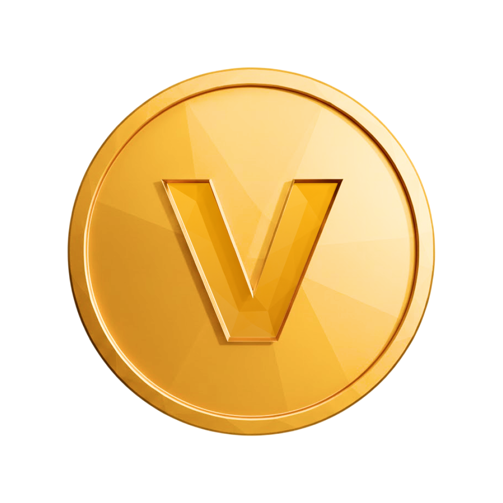

## Viessmann Game (React + TypeScript + Vite)

Lekka gra przeglądarkowa o modernizacji domu i OZE. Zbieraj zasoby, kupuj urządzenia, stawiaj obiekty na izometrycznej mapie, rozwijaj profil i relacje. Aplikacja ma tryb dzień/noc, dynamiczną pogodę i wydarzenia fabularne z wyborami oraz konsekwencjami.

### Zasady gry (Rules)

- Zasoby: ☀️ Słońce, 💧 Woda, 🌬️ Wiatr,  ViCoins.
  - Produkcja zależy od pory dnia (dzień/noc) i pogody.
  - Startowe stawki rosną wraz z rozbudową; ViCoins rosną stale, wzrost może być zwiększany przez efekty.
- Pogoda (losowo, co pewien czas):
  - Chmury ☁️: 0× ☀️
  - Słońce 🌞: 2× ☀️
  - Deszcz 🌧️: 2× 💧
  - Wiatr 🌬️: 2× 🌬️, −50% ☀️, −30% 💧
  - Mróz ❄️: pauza wszystkich produkcji na czas wydarzenia
- Sklep i progresja:
  - Urządzenia (pojedyncze zakupy): węgiel → pellet → gaz → pompa ciepła → inverter/magazyn → grid.
  - Produkcja (wiele sztuk): las, fotowoltaika, e-charger.
  - Skalowanie kosztów:
    - Las: każdy kolejny +8 ☀️ i +8 💧 do bazowej ceny.
    - PV (Vitovolt): koszt rośnie geometrycznie o ~15% względem bazowej ceny za każdy posiadany panel.
    - E‑Charger: koszt rośnie geometrycznie o ~18% względem bazowej ceny za każdą posiadaną sztukę.
  - Zasady stawiania: kocioł węglowy/pellet/gaz tylko na kafelku domu; pozostałe na wolnych kafelkach (dom musi pozostać wolny, jeśli na nim nic nie ma).
  - E-Charger: +5 ViCoins/min (pasywny bonus).
  - Las: silna redukcja zanieczyszczenia (opis w karcie sklepu), działa stale po postawieniu.
- Zanieczyszczenie 🏭:
  - Węgiel podnosi, pellet i las redukują; gaz obniża w stosunku do pelletu.
  - Celem jest ekologiczna modernizacja i ograniczanie emisji.
- Eko‑reputacja ⭐:
  - Definicja: 0–100, liczona w locie jako 100 − smog + min(20, 5×lasy).
  - Efekty: daje premię do ViCoins przy niskim smogu, wpływa na wydarzenia i relacje; podpowiedź dostępna po najechaniu na pigułkę w nagłówku.
- Wydarzenia fabularne i wybory:
  - Silnik historii dobiera zdarzenia ważone, z cooldownami i warunkami (pora roku, smog, eko‑reputacja, posiadane flagi).
  - Występują frakcje (Relacje): Mieszkańcy (community) i Dostawcy (suppliers) – wybory zmieniają ich opinię i mogą odblokowywać/ blokować kolejne zdarzenia lub premie.
  - Przykłady konsekwencji: follow‑up po podpisaniu porozumienia z dostawcą (dopłać teraz albo gorsze warunki), protest mieszkańców przy niskiej opinii (koszt konsultacji vs wzrost smogu), krytyka prasowa przy niskiej eko‑reputacji (chwilowy wzrost cen vs wydatek i redukcja smogu).
- Kompendium → Relacje:
  - Osobna zakładka z paskami opinii frakcji i dymkami informacyjnymi, z progami korzyści opisanymi kontekstowo.
- Misje:
  - Panel „Misje” pokazuje postęp (paski) oraz nagrody.
  - W tej wersji: ikona ViCoin została zaktualizowana na trwały asset (plikiem: `src/assets/ui/ViCoin_LM.png`) zamiast emoji. Panel Misji używa kart misji (medalion po lewej, tytuł/opis po prawej, nagroda poniżej). Ukończone misje pokazują obrazek check (`src/assets/ui/Check.png`) zamiast znaku ✓ oraz mają pogrubioną, zieloną ramkę (#7BB894).
  - Przykłady: Pierwsze kroki (postaw kocioł węglowy) → +10 ViCoins; Ekologiczny wybór (zamień węgiel na pellet) → −20 zanieczyszczenia; Zielona inwestycja (posadź las) → −30 zanieczyszczenia.
  - Ukończenie misji nie jest zapisywane między sesjami (każda sesja to nowa runda pod kątem misji).
  - Zakładki „Aktywne”/„Ukończone” filtrują listę misji, a ozdobny badge (w wariantach dzień/noc) pojawia się nad nagłówkiem.
- Osiągnięcia (odblokowują się automatycznie):
  - First Steps: postaw pierwsze urządzenie.
  - Heat Source: posiadaj źródło ciepła.
  - Going Green: zainstaluj OZE.
  - Power Up: zbuduj infrastrukturę (inverter + grid).
- Dziennik (📝) i filtry:
  - Typy wpisów: zakupy, ustawienia (placement), misje, pogoda, osiągnięcia, kamienie milowe.
  - Filtry działają po typie; starsze wpisy są migrowane po tytule.
- Powiadomienia (dzwonek):
  - Toasty pojawiają się tylko przy nowych osiągnięciach.
  - Wpisy dotyczące misji i pogody trafiają do Dziennika bez toastów.
  - Przyciski w prawym górnym rogu: „Mój profil” ma czerwoną kropkę, gdy są nowe osiągnięcia lub wpisy w Dzienniku.
- Tryb nocny:
  - Menu profilu, popupy Osiągnięć i Dziennika oraz karty mają ciemne tło i jasne teksty.

### Sterowanie

- Kupno w sklepie wymaga zasobów; po zakupie elementy umieszczaj klikając kafelek na mapie.
- Profil → „Osiągnięcia”/„Dziennik” otwiera odpowiednie popupy; klik na tło zamyka okna. Panel „Misje” jest dostępny z prawej strony ekranu.
- Podczas ustawiania elementów na mapie można anulować klawiszem Esc.

### Persistencja i zapisy gry

Stan gry i profil są zapisywane w localStorage:

- vm_achUnlocked – mapa odblokowanych osiągnięć (timestampy)
- vm_seen_ach, vm_seen_log – znaczniki „ostatnio widziane” (czerwone kropki)
- vm_log – wpisy dziennika (z typami)
- vm_save_v2 – automatyczny zapis rdzenia (kafelki, zasoby, zanieczyszczenie) + metadane v2
- vm_eco_hist – historia eko‑reputacji (wykres w Kompendium)
- vm_story_decisions – skrócony dziennik decyzji fabularnych
- vm_story_flags – flagi fabularne (odblokowania, stany)
- vm_factions – opinie frakcji (Relacje)

Zapisy gry:

- „Zapisz grę” – eksportuje zapis do pliku JSON.
- „Wczytaj grę” – importuje zapis z pliku JSON.
- „Nowa gra” – resetuje stan (czyści vm_save_v1, resetuje mapę/zasoby/zanieczyszczenie oraz znaczniki „widziane”).
- Misje: stan ukończenia nie jest utrwalany między sesjami (brak persistencji ukończeń).

### Development

- Stack: React + TypeScript + Vite.
- Kod główny: `src/ViessmannGame.tsx` (logika gry, UI, profil, dziennik, toasty, misje, pogoda).
 - Zdarzenia i relacje: `src/lib/story.ts` (kontekst, API historii, definicje zdarzeń i progi relacji).

Uruchamianie lokalne (dev, localhost):

```
npm install
npm run dev
```

Dev serwuje pod http://localhost:5174/ (konfiguracja wymusza host localhost i HMR na localhost).

Build (prod):

```
npm run build
```

